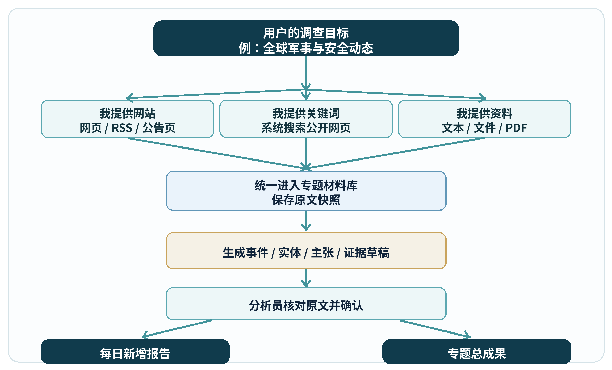
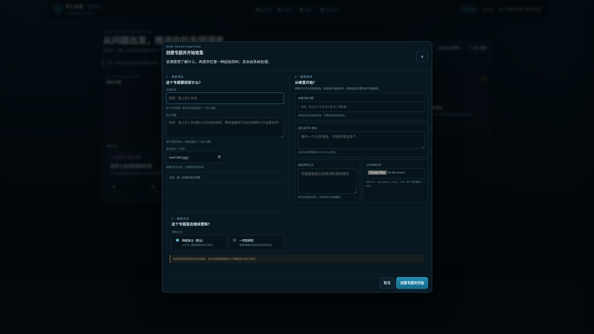
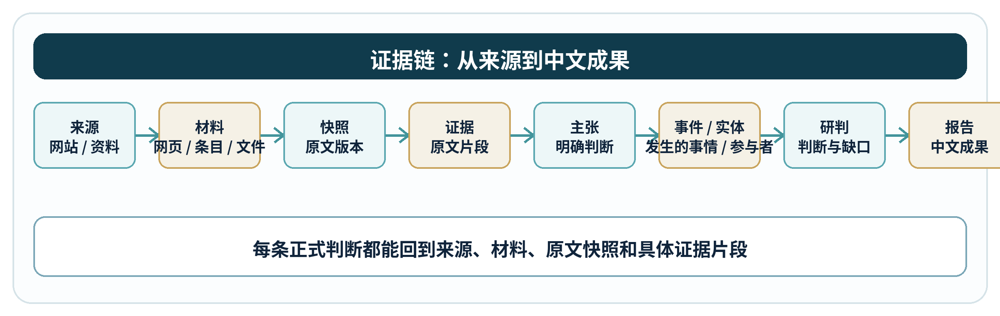
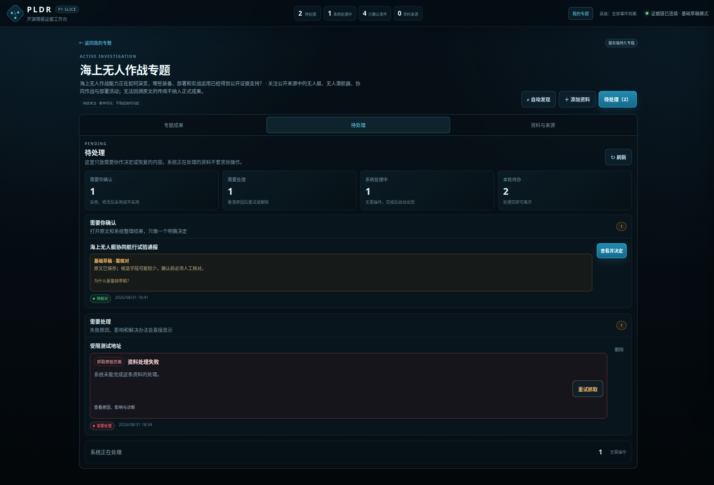
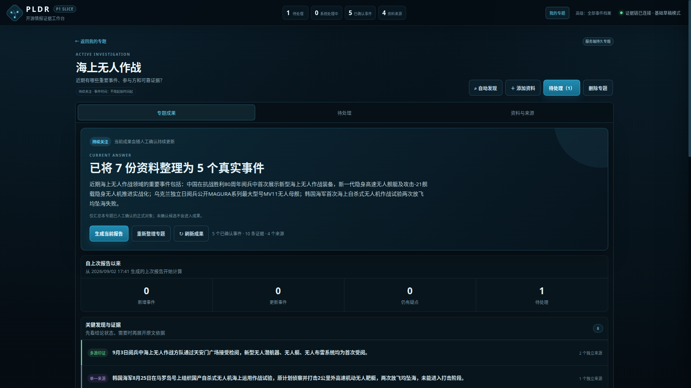
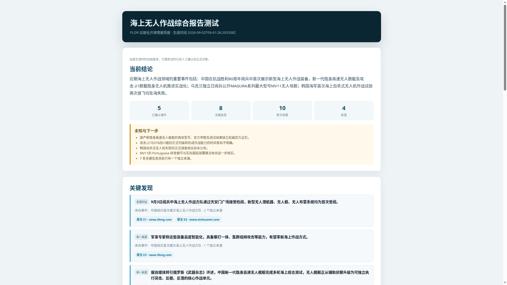

# PLDR 开源情报工作台功能与性能指标要求

**版本：** P1 可测试版 v1.3

**更新时间：** 2026-09-02

## 1. 一句话说清 PLDR

PLDR 帮助分析员围绕一个明确问题持续收集公开信息，把新材料整理成可核对的事件、人物、组织、地点、主张和证据，并输出中文的可留存报告和持续更新的专题成果。每日自动报告仍是后续目标。

用户只需要说明三件事：

```text
我要查什么
我关心哪些关键词和网站
我手上已有哪些资料
```

PLDR 负责搜索、采集、保存原文、生成草稿、组织证据，并在人工确认后形成可交付成果。



## 2. 用户获得的结果

PLDR 输出两类成果。

### 2.1 阶段报告与每日新增报告

每日报告回答：

```text
今天新增了什么？
哪些来源发生了变化？
哪些材料等待核对？
哪些事件得到确认？
哪些信息仍需补充？
```

当前已经可以按需生成“当前冻结报告”，并在专题成果页显示“自上次报告以来”的新增和疑点；自动按日生成与留存仍是 P1 后续项。

适用场景：

- 每天早间安全简报
- 突发事件跟踪
- 固定来源变化通报
- 待处理材料清单

### 2.2 专题总成果

总成果是一个持续沉淀的专题档案，回答：

```text
截至目前确认了哪些事件？
涉及哪些人物、组织和地点？
每条主张有什么证据？
不同来源之间有哪些分歧？
当前整体判断是什么？
还有哪些信息缺口？
```

总成果会随着新材料和人工确认持续更新。

## 3. 信息入口

### 3.1 当前输入入口

| 入口 | 用户提供什么 | 系统做什么 | 当前状态 |
| --- | --- | --- | --- |
| 创建专题并开始 | 专题名称；核心问题可采用系统建议；事件时间可选；持续关注或一次性研究 | 在同一窗口创建专题并立即启动首批资料收集 | 已实现 |
| 我提供关键词 | 一段自然语言或关键词，例如“红海航运风险”“某地军演” | 自动识别查询语言，搜索新闻和公开网页；按规范化 URL 去重；把首批原网页送入处理队列 | 已实现 |
| 我提供已有资料 | 一个或多个网页/RSS 地址、粘贴文本、TXT、Markdown、HTML、PDF | 先保存原始与提取快照并关联到新专题；再由持久后台任务生成候选事件、实体、主张和证据 | 已实现 |
| 我持续关注网站 | 固定网页或 RSS 地址及检查周期 | 周期检查；发现新条目或网页变化；保存快照 | 已实现；在专题资料库中继续添加 |

关键词、网页/RSS、粘贴文本和本地文件可以在创建专题时同时提交。用户不需要先建立一个空专题，再到资料库重复填写一次。



### 3.2 后续扩展入口

| 入口 | 用途 | 阶段 |
| --- | --- | --- |
| 结构化数据源 | 接入航班、船舶、地震、制裁清单、公开统计等结构化公开数据 | P1 后续计划 |
| 更多网站接口 | 为特定网站建立专用采集适配，提升稳定性和覆盖率 | P1 后续计划 |

## 4. 前置配置

普通用户只填写会改变调查结果的内容；采集语言、首批处理条数等技术参数不出现在默认表单中。

### 4.1 用户填写

```text
1. 专题名称
   例：海上无人作战

2. 核心问题
   系统根据专题名称自动建议，用户可以修改

3. 事件发生时间（可选）
   不是新闻发布时间

4. 首批资料
   关键词、网页/RSS、粘贴文本、本地文件可同时使用

5. 更新方式
   默认持续关注，也可选择一次性研究
```

### 4.2 系统自动完成

| 自动动作 | 当前行为 |
| --- | --- |
| 核心问题建议 | 根据专题名称生成一句可编辑的调查问题 |
| 起始关键词 | 用户未单独填写时使用专题名称开始搜索 |
| 来源语言 | 不要求用户选择；搜索按输入自动识别，导入材料保留原文 |
| 成果语言偏好 | 固定为中文，不要求用户每次设置 |
| 处理范围 | 使用系统受控默认值，不把数量参数交给普通用户 |
| 部分失败 | 已保存内容和专题继续保留，并显示具体失败原因 |
| 候选生成 | 创建窗口不等待外部模型；资料关联专题后由持久任务队列继续处理 |

当前尚未完成自动多语言关键词扩展、来源推荐和完整中文归一；这些能力必须在后续处理与呈现阶段单独实现和验收，不能作为现状宣传。

完整用户操作和实测截图见 `PLDR-USER-GUIDE.md`。

## 5. 系统处理流程

```text
入口材料
   ↓
公共网页抓取 / RSS 解析 / 文件解析
   ↓
保存原始材料与提取文本
   ↓
生成候选事件、实体、主张、证据
   ↓
等待确认 / 处理失败 / 系统正在处理
   ↓
普通材料多选加入或忽略；冲突材料单独修改、确认
   ↓
形成正式专题成果与可追溯报告
   ↓
持续监测新增与变化
```

## 6. 成果要素



| 要素 | 面向用户的含义 | 示例 |
| --- | --- | --- |
| 专题 | 用户正在调查的问题 | 全球军事与安全动态 |
| 来源 | 材料来自哪个网站或资料 | 新闻社、公告页、研究机构 |
| 材料 | 一份具体网页、RSS 条目或文件 | 某篇报道、某份公告 |
| 快照 | 采集时的原文版本 | 保存页面正文和采集时间；技术哈希不向普通用户展示 |
| 事件 | 已确认发生的事情 | 某港口实施临时限制 |
| 实体 | 事件涉及的人物、组织、地点、装备 | 国家、机构、港口、船舶 |
| 关键信息 | 从材料中归纳出的明确说法 | 限制从某日期开始生效 |
| 原文依据 | 支持关键信息、可在快照定位的原句 | 新闻原文中的具体句子 |
| 研判 | 当前综合判断、假设、缺口和证伪条件 | 影响评估、替代解释、待核实问题 |
| 报告 | 可交付的中文成果 | 每日报告、专题总成果 |

## 7. 功能清单

| 功能 | 当前结果 |
| --- | --- |
| 专题管理 | 创建专题；专题内组织材料、任务、搜索、事件、来源和报告；支持删除后恢复 |
| 关键词发现 | 通过 Brave Search 或 SearXNG 搜索新闻和公开网页；保存查询历史 |
| 选择性抓取 | 只处理用户选择或配置范围内的结果；逐条显示处理状态 |
| 固定网页监测 | 按周期检查网页；首次形成 V1；变化形成后续版本和差异 |
| RSS/Atom 监测 | 按周期发现新条目；重复条目不重复进入审核 |
| 资料导入 | 支持网页、粘贴文本、TXT、Markdown、HTML、PDF |
| 原文快照 | 保存原始材料、提取文本、采集时间和内容哈希 |
| AI 草稿 | 生成事件、实体、主张、证据及关系草稿 |
| 人工确认 | 待处理列表支持全选、多选、批量加入和批量忽略；普通项一次加入，合并或修改项额外确认 |
| 证据回链 | 已确认主张可回到证据片段、快照、材料和来源 |
| 跨资料整理 | 将多份网页按真实事件归并，提炼不照搬原文的关键发现；采用前预览，采用后保留原始资料和旧记录 |
| 来源印证 | 关键发现显示单一来源、多源印证或存在冲突；单一来源可直接搜索更多来源 |
| 来源健康 | 显示来源状态、检查时间、失败原因和重试入口 |
| 专题成果 | 汇总当前结论、报告后变化、关键发现与证据、时间线、参与方、未知项和报告历史 |
| 报告生成 | 生成当前结论、关键发现、真实事件脉络、信息缺口和来源附录；正文不按网页逐篇复述 |
| 中文输出 | 用户界面使用中文；成果语言偏好固定为中文；跨语种归一和最终中文成果仍需在后续处理/呈现阶段完成验收 |
| 在线使用 | 已有受登录保护的测试网站 `https://pldr.zhetengde.xyz`，可直接对照本文档体验当前功能 |

## 8. 功能指标要求

| 编号 | 指标 | 当前状态 | P1 要求 |
| --- | --- | --- | --- |
| F-01 | 专题隔离 | 已实现 | 材料、搜索、任务、事件、来源和报告默认归属当前专题 |
| F-02 | 关键词搜索 | 已实现 | 支持新闻和一般网页搜索；查询历史可重开；跨页去重 |
| F-03 | 选择性抓取 | 已实现 | 用户选择后逐条抓取原文；单条失败不影响其他条目 |
| F-04 | 固定网页监测 | 已实现 | 支持周期检查、版本差异、失败重试和暂停恢复 |
| F-05 | RSS 监测 | 已实现 | 支持新条目发现和重复条目计数 |
| F-06 | 资料导入 | 已实现 | 支持网页、文本和本地文件进入统一审核流程 |
| F-07 | 原文快照 | 已实现 | 保存原始与提取快照、时间、哈希和来源信息 |
| F-08 | AI 草稿 | 已实现 | 生成事件、实体、主张、证据和关系候选 |
| F-09 | 人工确认 | 已实现 | 支持全选、多选、批量加入和批量忽略；普通项一次完成；合并与修改显示影响后确认 |
| F-10 | 证据回链 | 已实现 | 已确认主张 100% 连接到可打开的证据片段 |
| F-11 | 报告生成 | 已实现 | 根据已确认事件生成证据化 HTML 简报 |
| F-12 | 每日报告 | 设计完成 | 汇总当日新增材料、新事件、来源变化、待核对项和缺口 |
| F-13 | 专题总成果 | 已实现当前切片 | 汇总当前结论、报告后变化、事件、实体、主张、证据、未知项和报告版本；只读取已确认对象 |
| F-14 | 来源包 | 计划中 | 提供可复用网站目录、关键词、频率和重要程度配置 |
| F-15 | RSS 原文追抓 | 计划中 | RSS 新条目可继续抓取原文页面并保存原文快照 |
| F-16 | 结构化数据源 | 计划中 | 接入专题所需的公开结构化数据 |
| F-17 | 专题删除恢复 | 已实现 | 删除专题进入可恢复区，不物理删除已有资料和正式档案 |
| F-18 | 用户界面去技术化 | 已实现 | 普通页面与报告不显示内容哈希；关键信息与原文依据明确分开 |
| F-19 | 跨资料综合 | 已实现 | 用户确认前预览；多份网页按真实事件归并，关键发现引用现有证据，原始资料和旧记录保留 |
| F-20 | 来源印证状态 | 已实现 | 关键发现显示单一来源、多源印证或存在冲突；单一来源可一键继续搜索 |
| F-21 | 综合报告 | 已实现 | 正文按结论与真实事件组织，网页仅作为证据引用和来源附录，不逐篇复述 |

## 9. 性能指标要求

### 9.1 采集能力

| 指标 | 当前状态 / P1 要求 |
| --- | --- |
| 固定网页监测周期 | 已支持；常用范围为 15 分钟至 24 小时 |
| RSS/Atom 监测周期 | 已支持；常用范围为 15 分钟至 24 小时 |
| 单次抓取正文上限 | 5 MB |
| 抓取总超时 | 30 秒 |
| 单个 RSS 每次处理条目 | 50 条 |
| P1 真实来源规模 | 30–50 个 |
| P1 连续运行 | 72 小时，并输出运行报告 |
| 任务恢复 | 进程重启后队列保持；过期任务可恢复 |
| 后台并发 | 默认 4 个受控工作槽，可在 1–32 范围配置；单条失败不阻塞其他任务 |
| 专题起始资料 | 网页、文本和文件先保存并排队，不以外部模型响应作为创建专题的前置条件 |

### 9.2 搜索能力

| 指标 | 当前状态 / P1 要求 |
| --- | --- |
| 搜索渠道 | Brave Search 或自管 SearXNG |
| 每页结果 | 10 或 20 条 |
| 单查询累计上限 | 100 条 |
| 单批选择上限 | 100 条 |
| 搜索超时 | 12 秒 |
| 去重方式 | 规范化 URL |
| 结果处理 | 勾选后逐条抓取原文 |

### 9.3 准确性与追溯

| 指标 | 要求 |
| --- | --- |
| 已确认证据原文命中率 | 100% |
| 已确认主张证据回链率 | 100% |
| 未确认草稿进入正式成果数量 | 0 |
| 重复确认产生重复正式对象数量 | 0 |
| 报告引用对象 | 已确认事件、主张和证据 |
| 专题重新整理覆盖率 | 预览中的全部原始事件恰好归入一个真实事件分组 |
| 综合发现证据回链率 | 100% |
| 成果语言 | 中文 |

### 9.4 可靠性

| 指标 | 要求 |
| --- | --- |
| 任务持久化 | queued、running、succeeded、failed 均入库 |
| 队列丢失 | 进程重启后为 0 |
| 失败隔离 | 单条材料失败不影响整批 |
| 失败可见性 | 显示阶段、原因、影响和建议动作 |
| 数据完整性 | 数据库完整性检查通过；升级前后业务对象计数保持 |

### 9.5 性能目标

以下为 P1 交付前需要建立基准并采样的目标值。

| 指标 | 目标 |
| --- | --- |
| 本地只读 API P95 | ≤ 500 ms |
| 首页可交互 | ≤ 3 秒 |
| 专题列表加载 | ≤ 2 秒 |
| 待核对列表加载 | ≤ 2 秒 |
| 专题成果首屏 | ≤ 3 秒 |
| 专题报告生成 | ≤ 10 秒 |
| 1440×900 桌面流程 | 可完成完整用户任务 |
| 390×844 窄屏流程 | 可完成核心任务且无横向溢出 |

### 9.6 当前网站实测结果

2026-08-31 从实际访问端绕过本机代理，对在线网站进行只读抽样，结果如下：

| 指标 | 要求 | 实测结果 | 结论 |
| --- | --- | --- | --- |
| 本地只读 API P95 | ≤ 500 ms | 专题列表 26.5 ms；待处理列表 32.3 ms；专题成果 67.4 ms；各 20 次 | 达到 |
| 在线首页 | ≤ 3 秒 | 首个 HTML 响应 1.26–2.92 秒；5 次 | 基础响应达到；完整可交互时间待浏览器计时 |
| 在线专题列表 | ≤ 2 秒 | 0.96–1.57 秒；3 次 | 达到 |
| 在线待处理列表 | ≤ 2 秒 | 1.45–1.98 秒；3 次 | 达到，余量较小 |
| 在线专题成果 | ≤ 3 秒 | 3.74–6.54 秒；3 次；响应约 285 KB | 未达到 |
| 专题报告生成 | ≤ 10 秒 | 本次未重新生成报告 | 待测 |

## 10. 安全与运行要求

| 指标 | 要求 |
| --- | --- |
| 公共来源协议 | HTTP(S) |
| 私网地址 | 拦截 |
| URL 内嵌凭据 | 拒绝 |
| 重定向安全 | 逐跳校验公共地址 |
| 响应大小 | 受上限约束 |
| 请求耗时 | 受总超时约束 |
| 管理接口 | 默认关闭；启用后使用令牌 |
| 公网访问 | 使用认证网关 |
| 密钥管理 | 仅从运行环境或受控秘密存储读取 |
| 日志敏感信息 | 密钥和凭据不出现在前端、日志或报告中 |

## 11. 对照网站检查

本文档中的截图来自实际运行页面，不是界面设计稿。访问网站后可以按以下顺序检查当前功能：

```text
创建专题并提交首批资料
→ 在待处理页面查看资料状态和失败原因
→ 全选或多选普通材料，批量加入专题或忽略
→ 冲突材料单独打开、修改并确认
→ 查看专题成果是否出现新增事件、关键信息和原文依据
→ 用“重新整理专题”预览并确认跨资料归并
→ 对单一来源发现点击“搜索更多来源”
→ 生成冻结报告并打开证据快照
```

桌面页面和 390×844 窄屏页面均应能够完成上述核心操作。未确认、处理失败或仍在处理中的资料不得进入正式成果和报告。

关键截图：

- 输入：`screenshots/input-01-unified-entry.png`
- 待处理：`screenshots/process-01-attention-queue.png`
- 人工决定：`screenshots/process-02-review-decision.png`
- 确认前影响：`screenshots/process-03-confirm-impact.png`
- 专题成果：`screenshots/output-01-topic-result.png`
- 冻结报告：`screenshots/output-04-report-top.png`
- 窄屏成果：`screenshots/output-05-mobile.png`







完整操作说明和逐项功能检查表见 `PLDR-USER-GUIDE.md`。30–50 个真实来源、自动每日报告、72 小时连续运行和性能基准仍是 P1 后续目标，不能当作当前已经具备的能力。
