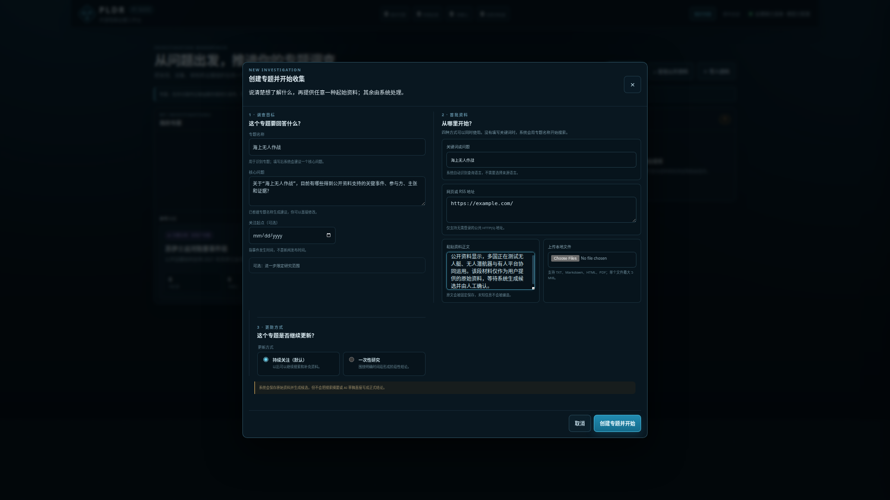
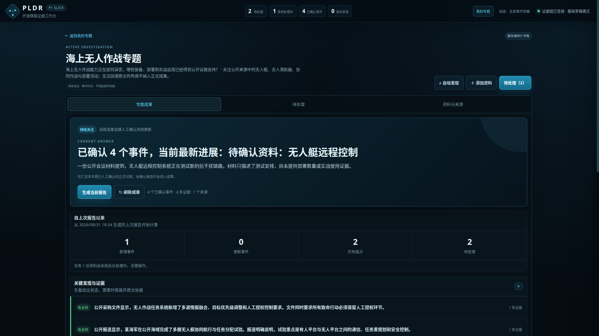
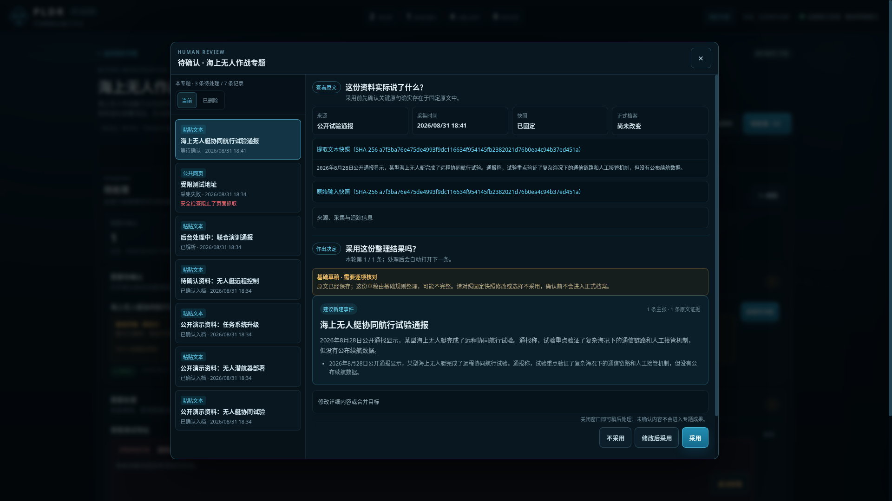
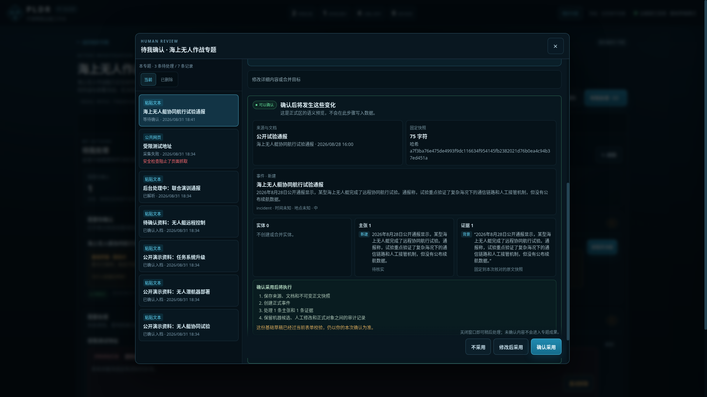
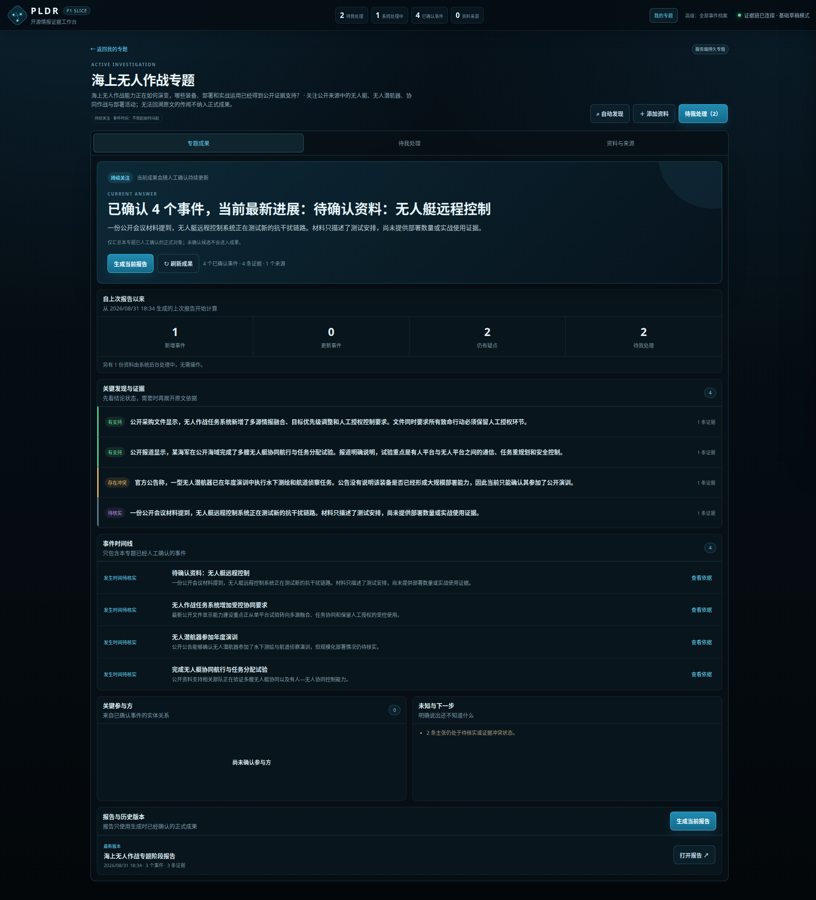
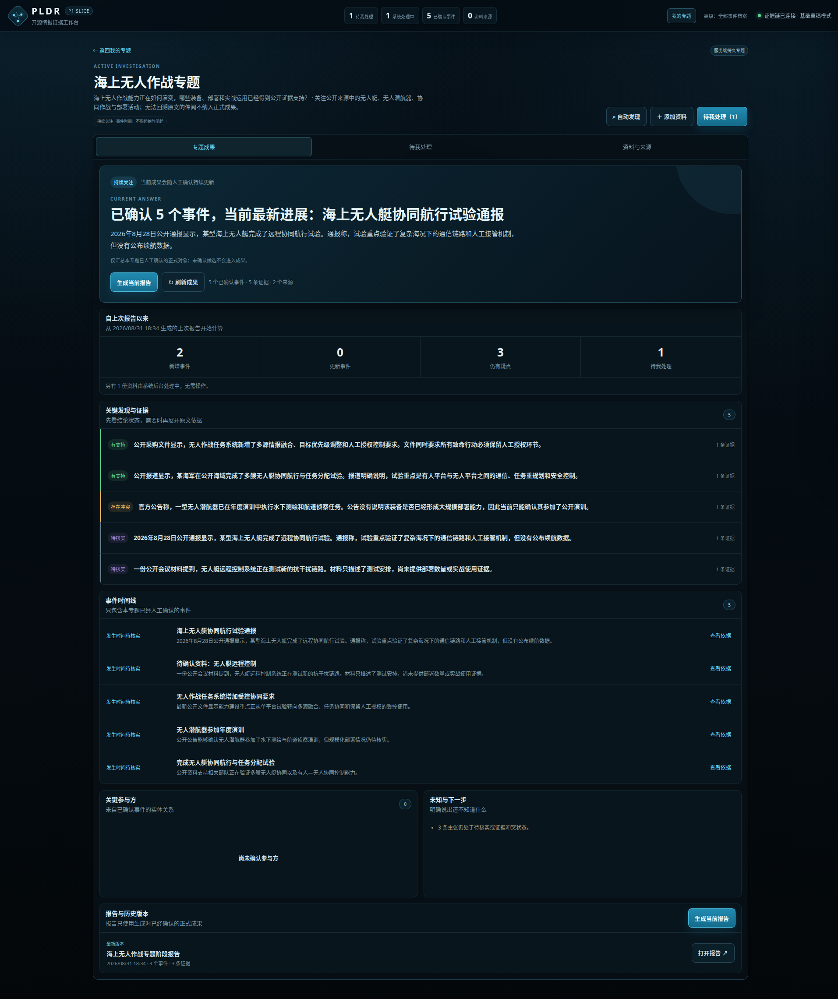
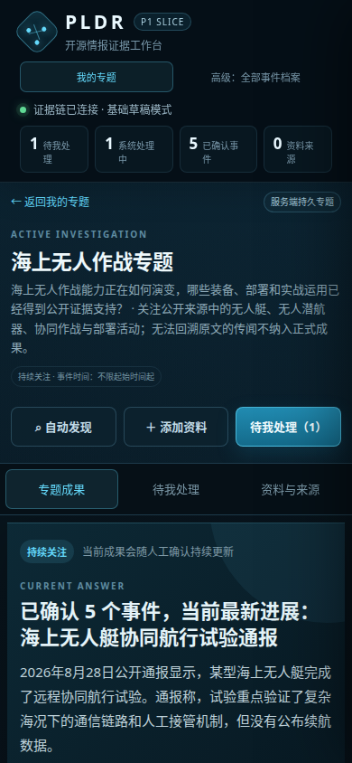

# PLDR 用户使用说明

**适用版本：** P1 当前可测试版

**更新时间：** 2026-09-04

**在线地址：** `https://pldr.zhetengde.xyz`
**访问说明：** 网站使用受控测试账号；账号由管理员单独提供，本文档不保存密码。

## 1. PLDR 是干什么的

PLDR 用来围绕一个问题持续收集公开资料，把原文整理成可以核对的事件、关键信息和原文依据，最后形成中文专题成果和可留存报告。

完整功能指标和性能指标见《PLDR 功能与性能指标要求》。

普通用户只需要理解三部分：

```text
输入资料 → 系统整理、用户确认 → 查看专题成果
```

| 部分 | 用户要做什么 | 最后得到什么 |
| --- | --- | --- |
| 输入 | 说明要查什么；提供关键词、网页、文字或文件 | 一个已经开始收集资料的专题 |
| 处理 | 多选处理普通材料；只单独处理冲突、失败或需要修改的内容 | 经确认的正式事件、关键信息和原文依据 |
| 成果 | 查看当前结论、变化、证据、时间线和报告 | 持续更新的专题成果与冻结报告 |

## 2. 五分钟走通一条完整流程

1. 登录网站，在“我的专题”点击 **创建专题**。
2. 填写专题名称；核心问题可直接采用系统建议。
3. 至少提供一种首批资料：关键词、网页/RSS、粘贴文本或本地文件。
4. 点击 **创建专题并开始**，进入专题后打开 **待处理**。
5. 在列表中多选普通材料并点击 **批量加入专题**；需要修改的材料再单独打开。
6. 打开 **专题成果**，确认新增事件、关键信息和原文依据已经出现。
7. 点击 **生成当前报告**，检查报告只包含已确认内容，并能打开证据快照。

## 3. 第一部分：输入资料

### 3.1 一个窗口完成专题启动

在“我的专题”点击 **创建专题**。专题信息和首批资料在同一个窗口完成，不需要创建空专题后再重复添加。


用户填写：

1. **专题名称**：用于识别专题，例如“海上无人作战”。
2. **核心问题**：系统根据名称用普通语言建议“发生了什么、哪些已有资料支持、哪些仍需确认”，用户可以直接修改。
3. **事件时间**：可选，指事情发生的时间，不是新闻发布时间。
4. **更新方式**：默认持续关注，也可以选择一次性研究。

### 3.2 四种输入可以一起用

| 输入方式 | 用户怎么做 | 系统当前怎么处理 |
| --- | --- | --- |
| 关键词或问题 | 输入搜索词或一句问题 | 搜索公开资料并先做专题相关性初筛；明确相关的首批原网页进入处理，其余结果保留供用户选择 |
| 网页或 RSS | 每行填写一个公开 HTTP(S) 地址 | 保存网页或 RSS 材料，再由后台生成候选 |
| 粘贴文本 | 粘贴已经获得的原文 | 先保存原始文本和快照，再由后台生成候选 |
| 本地文件 | 选择 TXT、Markdown、HTML 或 PDF | 保存文件和可核验文本；单个文件最大 5 MiB |



用户不需要选择来源语言。系统保留原文，用户看到的成果以中文为主；当前版本尚不承诺一次查询自动覆盖所有语言，也不把机器翻译冒充原始证据。

### 3.3 创建后立即进入专题

点击 **创建专题并开始** 后：

```text
专题先保存
→ 搜索和已有资料分别进入专题
→ 原文先保存
→ 后台继续整理候选
→ 用户可以立即离开创建窗口
```

外部模型慢或暂时失败时，已经保存的专题和资料不会被撤销；一条资料失败也不会拖垮整批。

专题创建后再点击 **添加资料** 也遵循同一规则：窗口只等待原始资料保存，随后回到专题“待处理”；AI 在后台继续整理，完成后进入“等待确认”。如果 AI 暂时失败，原文仍保留并按重试规则继续处理，不要求用户守着导入窗口。

关键词搜索不会再把排名靠前的若干结果不加判断地塞入“待处理”。系统根据专题名称和本次关键词，对搜索标题和摘要做保守初筛：**与专题相关**的首批结果可以自动开始抓取；**相关性存疑**和**可能无关**的结果保留在“资料与来源 → 发现资料”，由用户决定是否处理。初筛不是事实判断，也不会删除结果。

专题设有事件开始时间时，搜索服务返回的发布时间、搜索摘要中明确标注的媒体发布日期，或新闻地址中完整的年月日，早于该范围的结果会标为 **时间范围待核对**，只保留在线索区，不会自动进入待处理。没有明确发布标记的正文日期和链接查询参数不会被当成发布时间。材料处理后若识别出明确的事件时间，加入专题前还会再次检查是否落在专题事件范围内；若 AI 漏填时间或只返回带说明的原文时间提示，但正文开头明确写有“当地时间 11 日”等事件提示且材料年月已知，系统会保留该原文提示并补全日期，不直接照搬新闻发布时间。

网页处理顺序是：**安全直抓 → 正文质量检查 → 必要时调用已配置的 Reader → 清理成分段正文**。Reader 默认关闭，由部署人员明确开启；任何私网、非公网地址或不安全重定向都会直接拦截，直抓连接固定到已经校验的公网 IP，不能借 DNS 变化或 Reader 绕过。系统优先提取标题、发布日期和正文段落，搜索摘要不能替代网页原文。



## 4. 第二部分：系统处理和人工确认

### 4.1 “待处理”只保留真正要操作的事

首页右侧是 **进行中专题待处理**，只汇总当前进行中的用户专题并明确标出归属；已删除专题和系统待归类资料不会混入。进入某个专题后，“待处理”只读取该专题的任务；系统待归类资料仍可从“全局待确认”入口集中处理。

专题里的内容分为三组：

| 分组 | 含义 | 用户要做什么 |
| --- | --- | --- |
| 等待确认 | 原文已保存，系统已经整理出结果 | 可多选后批量加入专题或批量忽略；冲突项单独打开 |
| 需要处理 | 抓取或生成失败 | 看清原因后重试；不再需要的可以删除 |
| 系统正在处理 | 后台还在抓取或整理 | 无需操作，完成后会自动进入待确认 |


失败项必须直接说明：**在哪里失败、产生什么影响、下一步能做什么**。例如私网地址被安全规则阻止时，页面会明确显示安全拦截，而不是笼统提示“未知错误”。

如果 AI 超时或暂时返回无效结果，任务会显示 **等待 AI 重试**，后台按退避时间继续分析，用户无需逐条操作；网页原文不会重复抓取，也不会丢失。默认自动重试 3 次，多次重试仍失败后才显示 **AI 分析失败/超时** 和 **重新分析**。系统不会用规则摘录冒充成功的 AI 结果；没有配置模型时才会明确显示规则模式。

### 4.2 用户只做三个决定

打开一条待确认资料后，先看固定原文，再看系统整理结果。



| 决定 | 通俗含义 | 对正式成果的影响 |
| --- | --- | --- |
| 加入专题 | 整理结果基本正确 | 系统先校验；没有合并冲突时一次完成 |
| 修改 | 内容有用，但标题、时间、地点、关键信息或合并目标要调整 | 保存修改后的正式结果 |
| 忽略 | 与专题无关、重复或无法核实 | 保留处理记录，正式成果不改变 |

如果系统发现同名正式事件，会建议合并；高级修改项默认收起，不干扰普通用户。

### 4.3 普通材料一次完成，冲突材料再确认

点击 **加入专题** 后，系统会先校验以下内容：

- 保存哪个来源、材料和固定快照；
- 新建还是合并事件；
- 写入几条关键信息和原文依据；
- 证据原句能否定位到本次固定原文。

没有冲突时一次完成；发现同名事件、需要合并或用户修改了字段时，页面先显示影响，再要求确认。这个边界避免批量操作把材料未经确认地写进正式成果。

如果 AI 给出的某条依据不能精确回到已保存的原文，系统会默认排除该依据；某条关键信息如果因此完全失去依据，也会一并排除。其他能回到原文的内容仍可直接加入专题，单个坏候选不会卡住整份材料；用户也可以展开修改区自行修正。

列表支持全选、多选、**批量加入专题**和**批量忽略**。处理完成的内容会立即离开“待处理”，历史可在专题操作记录中查看。



### 4.4 正式成果写入规则

```text
搜索结果、网页摘要、AI 草稿 ≠ 正式成果

只有：固定原文 + 可定位证据 + 用户明确确认
才会进入专题成果和报告
```

因此，用户在“待处理”看到的候选不会提前出现在专题结论中；不采用、失败和仍在后台处理的内容也不会混入正式报告。

## 5. 第三部分：专题成果

### 5.1 进入专题先看结果

打开专题后默认进入 **专题成果**。这里不是数据库对象列表，而是直接回答用户最关心的问题：

1. **当前结论**：截至目前能确认什么。
2. **自上次报告以来**：新增、更新、疑点和待处理数量。
3. **关键发现与证据**：结论状态和原文依据。
4. **事件时间线**：已经确认的事件，不显示候选。
5. **关键参与方**：已经确认的人物、组织、地点或装备。
6. **未知与下一步**：明确说出仍不知道什么。
7. **报告与历史版本**：生成当前冻结报告，回看历史版本。


完整长页效果：



### 5.2 结论必须能回到证据

关键发现不会用一个不透明的“知情度总分”代替解释。系统按独立来源直接显示：

- **单一来源**：目前只有一个来源支持，不等于错误；可点击“搜索更多来源”自动带入该条发现继续搜索。
- **多源印证**：至少两个相互独立的来源支持。
- **存在冲突**：来源之间说法不一致，需要继续判断。

展开后可以看到：

- 精确原文片段；
- 来源和材料；
- 固定快照；
- 对该关键信息是支持、冲突还是背景。

多份网页进入专题后仍是“资料”，不应一篇网页变成一个事件。点击 **重新整理专题**，系统会先预览专题结论、真实事件分组和关键发现；用户确认后再替换成果页的组织方式。原始资料和旧记录都会保留。

### 5.3 持续专题与一次性专题

- **持续关注**：专题成果随新的人工确认继续更新；“自上次报告以来”显示变化。
- **一次性研究**：用户完成一轮收集和确认后生成报告，作为该次研究的冻结结果。

报告不是“实时页面的另一个入口”，而是生成时的冻结版本。后续新增内容不会偷偷改写旧报告。



### 5.4 冻结报告

报告只读取生成时已经确认的正式对象，依次展示当前结论、关键发现及其原文片段、按真实事件归并的脉络、信息缺口和来源附录；网页只作为引用依据，不再逐篇重复成报告正文。只有一个来源时，结论仍会回答当前掌握了什么，但会明确提示尚待独立来源印证。

报告和保存的原文在当前页面打开；看完后使用浏览器“后退”返回专题。这样在带登录保护的部署环境中也不会因新标签页丢失访问状态。


### 5.5 窄屏使用

核心成果页和待处理页已在 390×844 视口实际检查；内容纵向排列，不依赖横向滚动完成任务。



## 6. 逐项功能检查

### 6.1 输入检查

- [ ] 只填专题名称也能得到可编辑的核心问题建议。
- [ ] 关键词、网页、粘贴文本和文件可在一个窗口同时提交。
- [ ] 用户不需要选择语言或首批处理条数。
- [ ] 点击创建后专题先保存，后台处理不会阻塞窗口。
- [ ] 在已有专题添加资料时，原文保存后即返回待处理页，AI 在后台继续整理。
- [ ] 一条资料失败不影响其他资料进入专题。

### 6.2 处理检查

- [ ] “待处理”能区分需要确认、失败和后台处理中。
- [ ] 失败项显示原因、影响以及重试或删除动作。
- [ ] 待确认项先显示固定原文，再显示候选摘要。
- [ ] 列表可全选或多选，并可批量加入专题、批量忽略。
- [ ] 普通材料点击“加入专题”可一次完成；合并或修改时会额外确认。
- [ ] 加入专题后处理数量同步减少，已完成内容不再停留在待处理列表。
- [ ] 忽略后正式成果数量不增加。
- [ ] 专题可删除到“已删除专题”并恢复，不物理删除已有资料。
- [ ] 普通页面和报告不显示内容哈希。

### 6.3 成果检查

- [ ] 专题默认打开成果页，而不是工程对象列表。
- [ ] 当前结论、变化、关键发现、时间线、未知项和报告入口可见。
- [ ] 多份网页可通过“重新整理专题”预览并归并成较少的真实事件，确认前不改变成果。
- [ ] 关键发现显示“单一来源 / 多源印证 / 存在冲突”；单一来源可一键带入搜索。
- [ ] 未确认候选不会出现在成果和报告中。
- [ ] 展开关键信息能够看到精确原文、来源和快照入口。
- [ ] 没有明确发生时间的事件单独进入“时间待补充”，不混入正常时间线。
- [ ] 确认一条新资料后，成果数量和“自上次报告以来”同步变化。
- [ ] 新报告只包含已确认内容，并说明它是冻结版本。
- [ ] 报告正文按结论和真实事件组织，不逐篇复述网页；来源集中列在附录。
- [ ] 桌面端和 390×844 窄屏都能完成核心流程。

## 7. 网站实际效果

本文档中的截图来自实际运行页面，不是界面设计稿。网站已按以下用户流程实际走通：

```text
创建专题
→ 放入三条待确认资料
→ 打开待处理队列并全选
→ 批量加入专题
→ 三条材料立即离开待处理
→ 专题成果出现三个事件、关键信息和原文依据
→ 没有明确时间的事件进入“时间待补充”
→ 删除专题后在“已删除专题”恢复
→ 生成只包含已确认内容的冻结报告
→ 在 390×844 视口检查成果页和待处理页
```

上述每一步都可以在网站中直接观察：处理状态会变化，确认后正式成果数量会增加，忽略或失败的资料不会进入正式成果。截图使用功能演示数据，线上数量会随实际使用变化。
